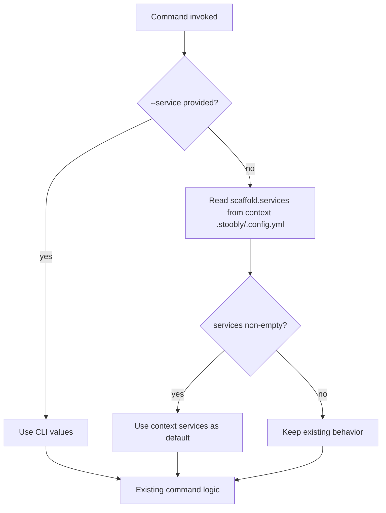

# Context directory services

## What it does

A Stoobly **context directory** is the folder that contains `.stoobly/` (settings, certs, and so on). When you scaffold an app or services with `--context-dir-path`, the agent writes a `.stoobly/.config.yml` file that links the context to the app scaffold and records which services belong to that context.

The `scaffold.services` list in that file is used as the **default value for `--service`** on scaffold commands when you do not pass `--service` explicitly. This lets each context (for example, a Cypress or Playwright project directory) operate on a focused subset of services without repeating `--service` on every command.

## Context config file

Path: `{context_dir}/.stoobly/.config.yml`

Example:

```yaml
scaffold:
  app_dir_path: ../app
  services:
    - api
    - assets
```

| Key | Description |
|-----|-------------|
| `scaffold.app_dir_path` | Relative path from the context directory to the application scaffold directory. |
| `scaffold.services` | Service names recorded for this context. Used as `--service` defaults when non-empty. |

### How `scaffold.services` is populated

| Command | Effect on `scaffold.services` |
|---------|----------------------------|
| `scaffold app create --context-dir-path …` | Resets `services` to `[]`. Also writes `app_dir_path`. |
| `scaffold service create --context-dir-path … SERVICE` | Appends `SERVICE` if not already listed. Updates `app_dir_path`. |
| `stoobly-agent init` | Does **not** write `.config.yml`. |

`scaffold service create` without `--context-dir-path` does not update any context config.

## `--service` default resolution

When a scaffold command accepts `--service`, the agent resolves which services to use before running the command logic.



### Rules

1. **Explicit `--service` always wins.** If you pass one or more `--service` options, context config is ignored for service selection.
2. **Non-empty context list becomes the default.** If `--service` is omitted and `scaffold.services` has entries, those names are used.
3. **Empty or missing list keeps prior behavior.** If `scaffold.services` is `[]` or unset:
   - Commands that select from app services (for example `service list`, `workflow up`) default to **all** services, as before.
   - Commands that require explicit targets (for example `workflow create`, `workflow copy`) still do nothing when no services are given.

Resolution happens at runtime via `__apply_context_service_defaults()` in `scaffold_cli.py`, which reads the config with `get_context_services()` from `context_config.py`. Defaults are not shown in `--help` because they depend on the context's `.stoobly/.config.yml`.

## `--context-dir-path`

Service defaults are read from the context directory passed with `--context-dir-path`. When omitted, the default is the context directory detected from the current working directory (the parent of `.stoobly`).

All commands that support context service defaults accept `--context-dir-path`:

| Command | `--service` help |
|---------|------------------|
| `scaffold service list` | Select specific services. |
| `scaffold workflow create` | Specify the service(s) to create the workflow for. |
| `scaffold workflow copy` | Specify service(s) to add the workflow to. |
| `scaffold workflow down` | Select which services to tear down. Defaults to all. |
| `scaffold workflow logs` | Select which services to log. Defaults to all. |
| `scaffold workflow up` | Select which services to run. Defaults to all. |
| `scaffold workflow mkcert` | Select specific services. Defaults to all. |
| `scaffold workflow rewrite` | Select specific services. Defaults to all. |
| `scaffold workflow filter` | Select specific services. Defaults to all. |
| `scaffold hostname install` | Select specific services. Defaults to all. |
| `scaffold hostname uninstall` | Select specific services. Defaults to all. |

## Examples

### Set up a context with two services

```bash
stoobly-agent scaffold app create \
  --app-dir-path ./app \
  --context-dir-path ./e2e \
  --quiet \
  my-app

stoobly-agent scaffold service create \
  --app-dir-path ./app \
  --context-dir-path ./e2e \
  --quiet \
  api

stoobly-agent scaffold service create \
  --app-dir-path ./app \
  --context-dir-path ./e2e \
  --quiet \
  assets
```

`./e2e/.stoobly/.config.yml` now contains `scaffold.services: [api, assets]`.

### Use context defaults (no `--service`)

```bash
# Lists only api and assets (from context config)
stoobly-agent scaffold service list \
  --app-dir-path ./app \
  --context-dir-path ./e2e

# Brings up only api and assets for the record workflow
stoobly-agent scaffold workflow up \
  --app-dir-path ./app \
  --context-dir-path ./e2e \
  record
```

### Override context defaults

```bash
# Only api, even though context config lists api and assets
stoobly-agent scaffold service list \
  --app-dir-path ./app \
  --context-dir-path ./e2e \
  --service api
```

### Empty context services (all services)

After `scaffold app create --context-dir-path ./e2e`, `scaffold.services` is `[]`. Creating services without `--context-dir-path` does not update the list. In that case, omitting `--service` lists or runs **all** app services:

```bash
stoobly-agent scaffold service list \
  --app-dir-path ./app \
  --context-dir-path ./e2e
```

## Related code

| File | Role |
|------|------|
| `stoobly_agent/app/cli/scaffold/context_config.py` | Writes and reads `scaffold.services` in `.stoobly/.config.yml`. |
| `stoobly_agent/app/cli/scaffold_cli.py` | Applies context defaults to `--service` before command handlers run. |
