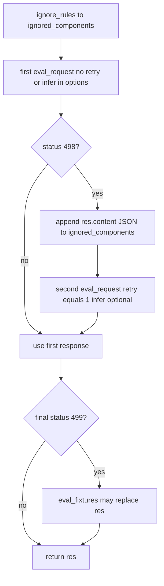
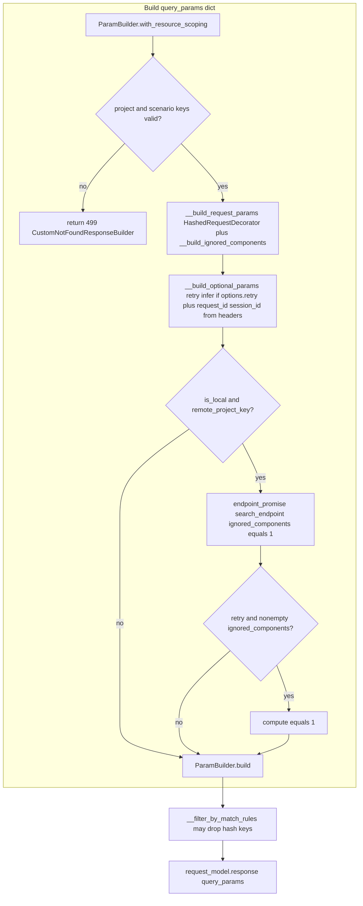
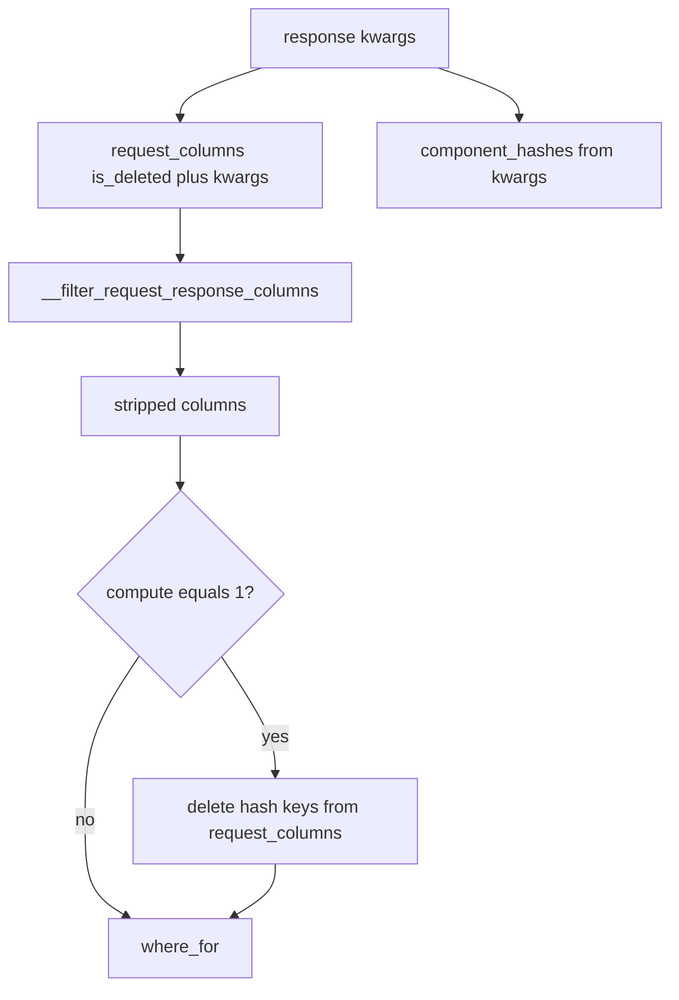
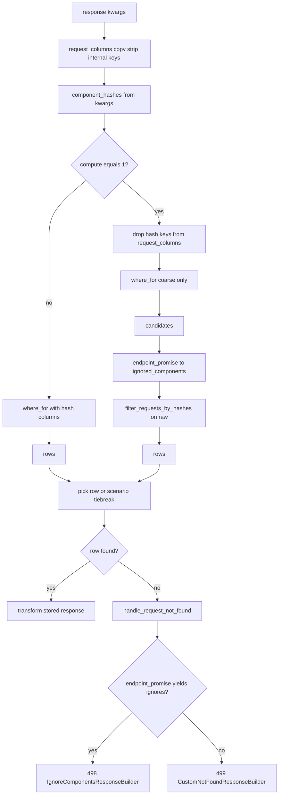

# Mock request matching

How an **incoming proxied request** is matched to a **recorded row** in the local DB for mocks: **hash-based** identity, optional **match rules** that drop hash dimensions, and optional **`compute`** to re-hash stored `raw` when **ignored components** change between record time and the retry path. Custom status codes: **`IGNORE_COMPONENTS = 498`**, **`NOT_FOUND = 499`** ([`custom_response_codes`](../stoobly_agent/app/proxy/constants/custom_response_codes.py)) — not standard HTTP 404/498.

---

## Diagram: mock handler, ignored components, and `eval_request_with_retry`

[`eval_request_with_retry`](../stoobly_agent/app/proxy/handle_mock_service.py) · [`handle_request_mock_generic`](../stoobly_agent/app/proxy/handle_mock_service.py) may prepend items from **ignore rules** into `ignored_components` before the first `eval_request`.

**498** = no DB row but `endpoint_promise` returned ignores (`IgnoreComponentsResponseBuilder`). **499** = `CustomNotFoundResponseBuilder` (no row and nothing to ignore, or invalid project/scenario key before DB). **Retry:** at most one second `eval_request`, only after **498**; outer handler may still apply **`FOUND`** upstream proxy, hooks, `pass_on`.

---

## Diagram: `eval_request` → kwargs → `request_model.response`

[`eval_request`](../stoobly_agent/app/proxy/mock/eval_request_service.py) builds one dict, then **`__filter_by_match_rules`** may delete hash keys before calling [`request_model.response(**query_params)`](../stoobly_agent/app/models/request_model.py).

---

## Diagram: kwargs vs `request_columns` vs `component_hashes`

[`__filter_request_response_columns`](../stoobly_agent/app/models/factories/resource/local_db/request_adapter.py) mutates the **`request_columns`** copy (drops `endpoint_promise`, `infer`, `project_id`, `retry`, `session_id`, `compute`). [`component_hashes(query_params)`](../stoobly_agent/app/models/factories/resource/local_db/helpers/filter_requests_by_hashes_service.py) reads hash fields from the **original** `response` kwargs.

---

## Diagram: local DB `response` when no `request_id`

---

## Remote project key and `compute`

When **local** + **remote project key**: **`compute='1'`** is attached only if **`retry`** and non-empty **`ignored_components`** after [`eval_request`](../stoobly_agent/app/proxy/mock/eval_request_service.py) ([`COMPUTE`](../stoobly_agent/config/constants/query_params.py)). That widens the ORM query and runs [`filter_requests_by_hashes`](../stoobly_agent/app/models/factories/resource/local_db/helpers/filter_requests_by_hashes_service.py) so stored **`raw`** is re-hashed with the same ignores as the live request.

---

## Hash dimensions

[`HashedRequestDecorator`](../stoobly_agent/app/proxy/mock/hashed_request_decorator.py): MD5 over **headers**, **query params** (multi-value), **body** as params or raw text per [`__build_request_params`](../stoobly_agent/app/proxy/mock/eval_request_service.py). Typed **ignored components** (`HEADER`, `QUERY_PARAM`, `BODY_PARAM`, …) exclude matching parts before hashing.

---

## Primary code references

| Concern | Location |
|--------|----------|
| Mock entry, retry, fixtures | [`handle_mock_service.py`](../stoobly_agent/app/proxy/handle_mock_service.py) |
| Query / hashes / match rules / `compute` | [`eval_request_service.py`](../stoobly_agent/app/proxy/mock/eval_request_service.py) |
| Local DB lookup, strip columns, not found 498/499 | [`request_adapter.py`](../stoobly_agent/app/models/factories/resource/local_db/request_adapter.py) |
| Candidate filtering | [`filter_requests_by_hashes_service.py`](../stoobly_agent/app/models/factories/resource/local_db/helpers/filter_requests_by_hashes_service.py) |
| Hashing | [`hashed_request_decorator.py`](../stoobly_agent/app/proxy/mock/hashed_request_decorator.py) |
