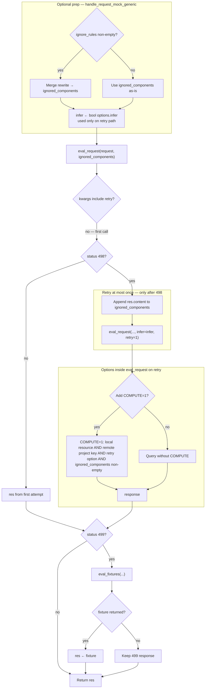
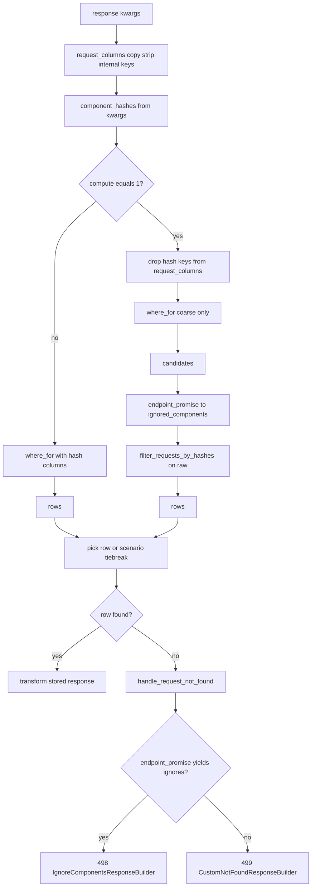

# Mock request matching

## Background

How an **incoming proxied request** is matched to a **recorded row** in the local DB for mocks: **hash-based** identity, optional **match rules** that drop hash dimensions, and optional **`compute`** to re-hash stored `raw` when **ignored components** change between record time and the retry path. Custom status codes: **`IGNORE_COMPONENTS = 498`**, **`NOT_FOUND = 499`** ([`custom_response_codes`](../stoobly_agent/app/proxy/constants/custom_response_codes.py)) — not standard HTTP 404/498.

### Remote project key and `compute`

When **local** + **remote project key**: **`compute='1'`** is attached only if **`retry`** and non-empty **`ignored_components`** after [`eval_request`](../stoobly_agent/app/proxy/mock/eval_request_service.py) ([`COMPUTE`](../stoobly_agent/config/constants/query_params.py)). That widens the ORM query and runs [`filter_requests_by_hashes`](../stoobly_agent/app/models/factories/resource/local_db/helpers/filter_requests_by_hashes_service.py) so stored **`raw`** is re-hashed with the same ignores as the live request.

### Hash dimensions

[`HashedRequestDecorator`](../stoobly_agent/app/proxy/mock/hashed_request_decorator.py): MD5 over **headers**, **query params** (multi-value), **body** as params or raw text per [`__build_request_params`](../stoobly_agent/app/proxy/mock/eval_request_service.py). Typed **ignored components** (`HEADER`, `QUERY_PARAM`, `BODY_PARAM`, …) exclude matching parts before hashing.

---

## Diagram: mock handler, ignored components, and `eval_request_with_retry`

[`eval_request_with_retry`](../stoobly_agent/app/proxy/handle_mock_service.py) merges **ignore rules** into `ignored_components` earlier in [`handle_request_mock_generic`](../stoobly_agent/app/proxy/handle_mock_service.py) (same list used for both attempts).

Supplements the diagram (not drawn above): **498** is “no row yet, but remote endpoint search returned suggested ignores” → [`IgnoreComponentsResponseBuilder`](../stoobly_agent/app/proxy/mock/ignored_components_response_builder.py) in [`request_adapter.response`](../stoobly_agent/app/models/factories/resource/local_db/request_adapter.py). **499** is the custom not-found response ([`CustomNotFoundResponseBuilder`](../stoobly_agent/app/proxy/mock/custom_not_found_response_builder.py)) for cases such as no usable match / no ignores from `endpoint_promise`, missing response row, or **invalid project or scenario key** before the DB path runs ([`eval_request`](../stoobly_agent/app/proxy/mock/eval_request_service.py)). If the **retry** response is still **498**, there is **no** third lookup. **`COMPUTE`** conditions and behavior are covered under [Remote project key and `compute`](#remote-project-key-and-compute) and in the diagram’s **Add COMPUTE=1?** branch. Outer mock policy **`FOUND`** may still **forward upstream** on **499** ([`handle_request_mock_generic`](../stoobly_agent/app/proxy/handle_mock_service.py)); lifecycle hooks and `pass_on` apply there.

---

## Diagram: local DB `response` when no `request_id`

---

## Primary code references

| Concern | Location |
|--------|----------|
| Mock entry, retry, fixtures | [`handle_mock_service.py`](../stoobly_agent/app/proxy/handle_mock_service.py) |
| Query / hashes / match rules / `compute` | [`eval_request_service.py`](../stoobly_agent/app/proxy/mock/eval_request_service.py) |
| Local DB lookup, strip columns, not found 498/499 | [`request_adapter.py`](../stoobly_agent/app/models/factories/resource/local_db/request_adapter.py) |
| Candidate filtering | [`filter_requests_by_hashes_service.py`](../stoobly_agent/app/models/factories/resource/local_db/helpers/filter_requests_by_hashes_service.py) |
| Hashing | [`hashed_request_decorator.py`](../stoobly_agent/app/proxy/mock/hashed_request_decorator.py) |
