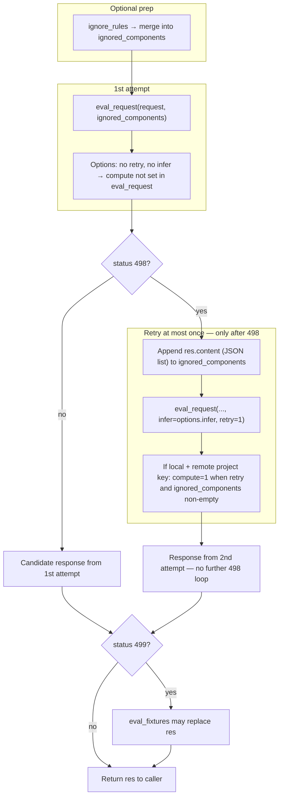
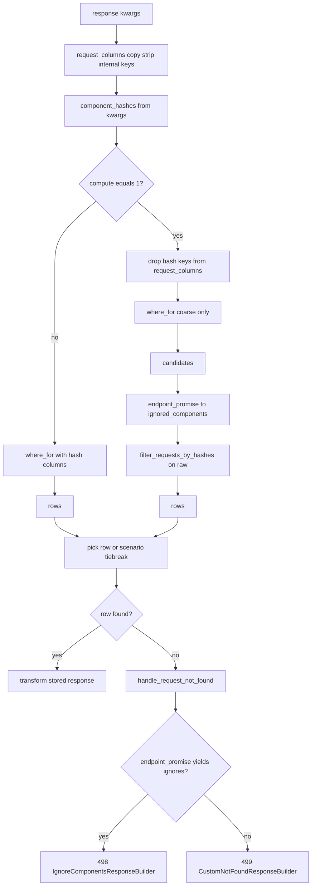

# Mock request matching

How an **incoming proxied request** is matched to a **recorded row** in the local DB for mocks: **hash-based** identity, optional **match rules** that drop hash dimensions, and optional **`compute`** to re-hash stored `raw` when **ignored components** change between record time and the retry path. Custom status codes: **`IGNORE_COMPONENTS = 498`**, **`NOT_FOUND = 499`** ([`custom_response_codes`](../stoobly_agent/app/proxy/constants/custom_response_codes.py)) — not standard HTTP 404/498.

---

## Diagram: mock handler, ignored components, and `eval_request_with_retry`

[`eval_request_with_retry`](../stoobly_agent/app/proxy/handle_mock_service.py) merges **ignore rules** into `ignored_components` earlier in [`handle_request_mock_generic`](../stoobly_agent/app/proxy/handle_mock_service.py) (same list used for both attempts).

**1st vs retry:** The first call never passes `retry`/`infer` into [`eval_request`](../stoobly_agent/app/proxy/mock/eval_request_service.py). Only if the first response is **498** does the handler append `res.content` and call `eval_request` again with `retry=1` and optional `infer` (at most **one** retry; a second **498** is returned as-is — there is no third lookup).

**498:** Local DB [`response`](../stoobly_agent/app/models/factories/resource/local_db/request_adapter.py) found no matching row; `endpoint_promise` (remote endpoint search) returned a non-empty ignore list → [`IgnoreComponentsResponseBuilder`](../stoobly_agent/app/proxy/mock/ignored_components_response_builder.py).

**499:** [`CustomNotFoundResponseBuilder`](../stoobly_agent/app/proxy/mock/custom_not_found_response_builder.py) — e.g. no row and `endpoint_promise` missing or returned no ignores, missing response row, or invalid project/scenario key ([`eval_request`](../stoobly_agent/app/proxy/mock/eval_request_service.py) returns 499 before hitting the DB). After the final `eval_request` (first or single retry), if status is **499**, [`eval_fixtures`](../stoobly_agent/app/proxy/mock/eval_fixtures_service.py) may supply a fixture response.

**`compute`:** Set inside `eval_request` only when **`retry`** is truthy **and** `ignored_components` is non-empty **and** the resource is local with a **remote project key** ([`COMPUTE`](../stoobly_agent/config/constants/query_params.py) = `'1'`). That matches the retry path after **498** (and not the first attempt, even if ignore rules pre-filled `ignored_components`). See also [Remote project key and `compute`](#remote-project-key-and-compute).

Outer mock policy **`FOUND`** may still forward upstream on **499**; hooks and `pass_on` apply after this function returns.

---

## Diagram: local DB `response` when no `request_id`

---

## Remote project key and `compute`

When **local** + **remote project key**: **`compute='1'`** is attached only if **`retry`** and non-empty **`ignored_components`** after [`eval_request`](../stoobly_agent/app/proxy/mock/eval_request_service.py) ([`COMPUTE`](../stoobly_agent/config/constants/query_params.py)). That widens the ORM query and runs [`filter_requests_by_hashes`](../stoobly_agent/app/models/factories/resource/local_db/helpers/filter_requests_by_hashes_service.py) so stored **`raw`** is re-hashed with the same ignores as the live request.

---

## Hash dimensions

[`HashedRequestDecorator`](../stoobly_agent/app/proxy/mock/hashed_request_decorator.py): MD5 over **headers**, **query params** (multi-value), **body** as params or raw text per [`__build_request_params`](../stoobly_agent/app/proxy/mock/eval_request_service.py). Typed **ignored components** (`HEADER`, `QUERY_PARAM`, `BODY_PARAM`, …) exclude matching parts before hashing.

---

## Primary code references

| Concern | Location |
|--------|----------|
| Mock entry, retry, fixtures | [`handle_mock_service.py`](../stoobly_agent/app/proxy/handle_mock_service.py) |
| Query / hashes / match rules / `compute` | [`eval_request_service.py`](../stoobly_agent/app/proxy/mock/eval_request_service.py) |
| Local DB lookup, strip columns, not found 498/499 | [`request_adapter.py`](../stoobly_agent/app/models/factories/resource/local_db/request_adapter.py) |
| Candidate filtering | [`filter_requests_by_hashes_service.py`](../stoobly_agent/app/models/factories/resource/local_db/helpers/filter_requests_by_hashes_service.py) |
| Hashing | [`hashed_request_decorator.py`](../stoobly_agent/app/proxy/mock/hashed_request_decorator.py) |
