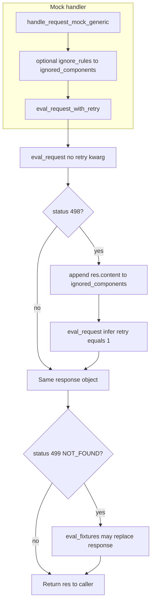
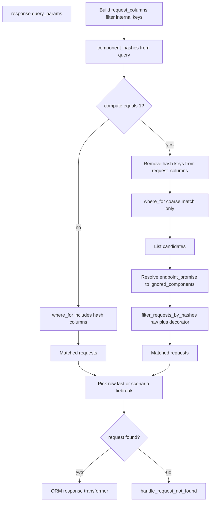

# Mock request matching

This document describes how the agent matches an **incoming proxied request** to a **recorded request** in the local database when serving mocks. Matching is primarily **hash-based** on normalized request parts. **Match rules** can drop hash dimensions for certain URLs. When **ignored components** (remote endpoint metadata) participate in a **retry**, the **`compute`** path can **re-hash stored raw traffic** so recorded rows still match even though persisted hash columns were computed at record time under different ignore rules.

## Remote project key and `compute`

When using a **local** request model with a **remote project key** (CLI `--remote-project-key` on `stoobly-agent run`, or `AGENT_REMOTE_PROJECT_KEY`), the mock path can resolve **which parameters to ignore** via the remote **endpoints** API (`search_endpoint` / `EndpointsResource.index`).

The query parameter **`compute=1`** (`stoobly_agent.config.constants.query_params.COMPUTE`) is passed into the local DB lookup when **all** of the following hold:

- The request model is local and a remote project key is configured.
- The call is a **retry** (after a **498** response with ignored components).
- **`ignored_components`** is non-empty.

That flag selects the **compute path** in `LocalDBRequestAdapter.response`: the ORM query omits hash columns to find **candidates**, then each candidate’s stored **`raw`** is re-hashed with `HashedRequestDecorator` and the same `ignored_components` before comparing to the incoming hashes.

## Hash dimensions

[`HashedRequestDecorator`](../stoobly_agent/app/proxy/mock/hashed_request_decorator.py) derives MD5 hashes from:

- **Headers** — serialized key/value pairs; configured header names can be ignored.
- **Query parameters** — multi-value aware; ignored query param names are excluded from the serialized material.
- **Body** — either **parsed body params** (`body_params_hash`) or **raw body** (`body_text_hash`), depending on body shape and whether body-param ignores apply; see [`__build_request_params`](../stoobly_agent/app/proxy/mock/eval_request_service.py).

**Ignored components** use typed entries (`HEADER`, `QUERY_PARAM`, `BODY_PARAM`, …) and strip the matching parts **before** hashing the live request. The same rules apply when recomputing hashes from each candidate’s stored request in **compute** mode.

## Mock handler and retry loop

[`eval_request_with_retry`](../stoobly_agent/app/proxy/handle_mock_service.py) implements the retry logic. Custom status codes are defined in [`custom_response_codes`](../stoobly_agent/app/proxy/constants/custom_response_codes.py): **`IGNORE_COMPONENTS = 498`**, **`NOT_FOUND = 499`** (these are not standard HTTP 404/200).

Behavior in code terms:

- **498** — At most **one** retry: append response body (`res.content`, JSON list from [`IgnoreComponentsResponseBuilder`](../stoobly_agent/app/proxy/mock/ignored_components_response_builder.py)) to `ignored_components`, then call `eval_request` again with `retry=1`.
- **499** — After the optional retry, [`eval_fixtures`](../stoobly_agent/app/proxy/mock/eval_fixtures_service.py) runs and may substitute a fixture response; there is no standard **404** in this path.
- **Other statuses** — Returned as-is (typical successful mocks use normal 2xx/3xx codes from the recorded response, not 200 as a special branch).

[`handle_request_mock_generic`](../stoobly_agent/app/proxy/handle_mock_service.py) also enforces **mock policy** (`NONE` skips mock, invalid policy yields 400), rewrites, hooks, and—when policy is **`FOUND`**—may **proxy upstream** if the response is still 499 after `__after_mock_not_found`. That outer behavior is omitted from the diagram above, which only covers `eval_request_with_retry`.

### When retry happens

Retry exists only inside [`eval_request_with_retry`](../stoobly_agent/app/proxy/handle_mock_service.py). There is **at most one** repeat of `eval_request`.

| Call | Trigger | `eval_request` arguments |
|------|---------|---------------------------|
| First | Always | `eval_request(request, ignored_components)` — no `retry` or `infer` in `**options` |
| Second | First response has **status 498** | `eval_request(request, ignored_components, infer=infer, retry=1)` where `infer` comes from mock `**options` (e.g. [`MockOptions`](../stoobly_agent/app/proxy/handle_mock_service.py)) |

So **`retry=1` is only present on the second call**. It is not an HTTP query string on the client request; it becomes a lookup field (see below) and is **stripped** before the ORM query.

### How **498** (`IGNORE_COMPONENTS`) is handled

- **Meaning:** The local adapter could not match a row, but an **`endpoint_promise`** (remote endpoints lookup) returned a non-empty **`ignored_components`** list, so the client should retry with those rules applied to hashing ([`IgnoreComponentsResponseBuilder`](../stoobly_agent/app/proxy/mock/ignored_components_response_builder.py) → status **498**, body JSON array of components).
- **Handler:** [`ignored_components.append(res.content)`](../stoobly_agent/app/proxy/handle_mock_service.py) (bytes body, same JSON as the builder wrote), then the second `eval_request` as above.
- **Not** a standard HTTP 498; it is a custom code in [`custom_response_codes`](../stoobly_agent/app/proxy/constants/custom_response_codes.py).

### How **499** (`NOT_FOUND`) is handled

- **Constant:** `NOT_FOUND = 499` — again a **custom** code, not HTTP 404.
- **Produced by [`CustomNotFoundResponseBuilder`](../stoobly_agent/app/proxy/custom_not_found_response_builder.py) when:**
  - No matching request row after lookup (including after compute path), and `endpoint_promise` is missing or yields no `ignored_components` to send ([`__handle_request_not_found`](../stoobly_agent/app/models/factories/resource/local_db/request_adapter.py)), **or**
  - Invalid `project_key` / `scenario_key` at the start of [`eval_request`](../stoobly_agent/app/proxy/mock/eval_request_service.py) (early return).
- **After `eval_request_with_retry`:** If the **final** response is still **499**, [`eval_fixtures`](../stoobly_agent/app/proxy/mock/eval_fixtures_service.py) may replace it with a fixture response; otherwise **499** is returned to the generic mock handler, which may then run failure hooks or (**`FOUND`** policy only) attempt upstream proxying.

### How **ignored_components** are built

[`__build_ignored_components`](../stoobly_agent/app/proxy/mock/eval_request_service.py) normalizes the list passed into `eval_request`:

- **Strings / bytes:** `json.loads` into a list of dicts (e.g. body from a **498** response).
- **Lists:** concatenated (nested lists flattened into the component list).
- **Dicts:** appended as single component specs.

**Sources of items before/during the two `eval_request` calls:**

1. **Mock ignore rules** — [`handle_request_mock_generic`](../stoobly_agent/app/proxy/handle_mock_service.py) may merge [`rewrite_rules_to_ignored_components`](../stoobly_agent/app/proxy/utils/rewrite_rules_to_ignored_components_service.py) into `options['ignored_components']` before any `eval_request`.
2. **498 retry** — After the first response is **498**, `res.content` is **appended** to the same list (second call hashes with a larger ignore set).

Those structures are fed to [`HashedRequestDecorator.with_ignored_components`](../stoobly_agent/app/proxy/mock/hashed_request_decorator.py) when computing **`headers_hash`**, **`query_params_hash`**, and body hashes in [`__build_request_params`](../stoobly_agent/app/proxy/mock/eval_request_service.py).

**Remote endpoint metadata (separate from the list):** When `request_model.is_local` and **`parsed_remote_project_key`** is set, [`eval_request`](../stoobly_agent/app/proxy/mock/eval_request_service.py) attaches an **`endpoint_promise`** callable that hits [`search_endpoint(..., ignored_components=1)`](../stoobly_agent/app/proxy/mock/search_endpoint.py). The local DB uses that promise in [`__ignored_components`](../stoobly_agent/app/models/factories/resource/local_db/request_adapter.py) when deciding **498** vs **499** on not-found and when running the **compute** filter (see [Remote project key and `compute`](#remote-project-key-and-compute)).

### Lookup parameters attached to `request_model.response` (local DB)

[`eval_request`](../stoobly_agent/app/proxy/mock/eval_request_service.py) builds a single **`query_params`** dict via [`ParamBuilder`](../stoobly_agent/lib/api/param_builder.py), then calls `request_model.response(**query_params)`. These are **adapter keyword arguments**, not query parameters on the original HTTP request.

| Field | How it is set | Role |
|--------|----------------|------|
| `project_id` | `with_resource_scoping` from project/scenario keys | Scoping; **removed** from ORM filter columns in [`__filter_request_response_columns`](../stoobly_agent/app/models/factories/resource/local_db/request_adapter.py) |
| `scenario_id` | From scenario key when present | ORM match |
| `host`, `path`, `port`, `method` | [`__build_request_params`](../stoobly_agent/app/proxy/mock/eval_request_service.py) | ORM match |
| `headers_hash`, `query_params_hash`, `body_params_hash` or `body_text_hash` | `HashedRequestDecorator` + optional removal by [`__filter_by_match_rules`](../stoobly_agent/app/proxy/mock/eval_request_service.py) | Match (or dropped by match rules) |
| `retry` | [`__build_optional_params`](../stoobly_agent/app/proxy/mock/eval_request_service.py) only if `options.get('retry')` | **Stripped** from ORM columns (not a DB column) |
| `infer` | Same, only with `retry` | **Stripped** from ORM columns |
| `request_id` | Header [`MOCK_REQUEST_ID`](../stoobly_agent/config/constants/custom_headers.py) if set | Forces lookup by id branch |
| `session_id` | Header / constant [`SESSION_ID`](../stoobly_agent/config/constants/query_params.py) | **Stripped** from ORM columns; used for scenario tie-break |
| `endpoint_promise` | Callable when local + remote project key | **Stripped** from ORM columns; kept on `query_params` for not-found / compute |
| `compute` | `'1'` when `retry` and non-empty `ignored_components` and remote key | **Stripped** from ORM columns after `should_compute` is read |

[`__filter_by_match_rules`](../stoobly_agent/app/proxy/mock/eval_request_service.py) runs **after** the dict is built and may **delete** hash keys entirely based on URL/method and match rules.

## Local DB `response` lookup without `request_id`

## `eval_request` pipeline (order of operations)

1. **`ParamBuilder.with_resource_scoping`** — Sets `project_id` and optionally `scenario_id`. Invalid keys → immediate **499** via [`CustomNotFoundResponseBuilder`](../stoobly_agent/app/proxy/mock/custom_not_found_response_builder.py).
2. **`__build_request_params`** — `host`, `path`, `port`, `method`, and hashes from [`HashedRequestDecorator`](../stoobly_agent/app/proxy/mock/hashed_request_decorator.py) with [`__build_ignored_components`](../stoobly_agent/app/proxy/mock/eval_request_service.py).
3. **`__build_optional_params`** — `retry` / `infer` only when the **second** call passes `retry` (see [When retry happens](#when-retry-happens)); `request_id` / `session_id` from [`X-Stoobly-Request-Id` / `X-Stoobly-Session-Id`](../stoobly_agent/config/constants/custom_headers.py) when present.
4. **Local + remote** — Optionally `endpoint_promise` and `compute` (see [Lookup parameters](#lookup-parameters-attached-to-request_modelresponse-local-db) and [Remote project key and `compute`](#remote-project-key-and-compute)).
5. **`ParamBuilder.build()`** then **`__filter_by_match_rules`** — May remove hash keys by URL/method.
6. **`request_model.response(**query_params)`** — Dispatches to the adapter (local DB behavior in [Local DB resolution](#local-db-resolution-localdbrequestadapterresponse)).

## Local DB resolution (`LocalDBRequestAdapter.response`)

When there is no explicit `request_id`:

1. Build **`request_columns`** from query params (internal keys stripped via [`__filter_request_response_columns`](../stoobly_agent/app/models/factories/resource/local_db/request_adapter.py)).
2. Extract **`component_hashes`**: any of `headers_hash`, `query_params_hash`, `body_params_hash`, `body_text_hash` present on the query ([`component_hashes`](../stoobly_agent/app/models/factories/resource/local_db/helpers/filter_requests_by_hashes_service.py)).
3. **Default path** (`compute` not `'1'`) — ORM [`where_for(**request_columns)`](../stoobly_agent/app/models/factories/resource/local_db/request_adapter.py) includes hash columns; the row must match **persisted** hashes from capture time.
4. **Compute path** (`compute='1'`) — Hash keys are removed from `request_columns` so the query matches **method, host, path, port, scenario**, etc. [`filter_requests_by_hashes`](../stoobly_agent/app/models/factories/resource/local_db/helpers/filter_requests_by_hashes_service.py) parses each candidate’s **`raw`**, applies [`HashedRequestDecorator(...).with_ignored_components`](../stoobly_agent/app/models/factories/resource/local_db/helpers/filter_requests_by_hashes_service.py), recomputes hashes, and keeps rows that match all supplied `component_hashes`. **`ignored_components`** come from resolving `endpoint_promise` ([`__ignored_components`](../stoobly_agent/app/models/factories/resource/local_db/request_adapter.py)). After filtering, `endpoint_promise` is cleared on `query_params` to avoid leaking ignore metadata on later not-found handling.
5. **Choose row** — Without `scenario_id`, the last row in the result list (most recent order); with `scenario_id`, existing session/tie-break logic applies.

**Rationale for compute mode:** Snapshots persist hash columns from **record** time. A **retry** that ignores (for example) a query parameter changes the **incoming** hashes. Direct equality on stored hash columns would miss. Compute mode widens the query, then **re-hashes stored traffic** with the **same** ignore list as the live request.

## Not found

If no row matches: [`__handle_request_not_found`](../stoobly_agent/app/models/factories/resource/local_db/request_adapter.py) may return **ignored components** from the endpoint promise via [`IgnoreComponentsResponseBuilder`](../stoobly_agent/app/proxy/mock/ignored_components_response_builder.py) (**498**), which drives the retry loop; otherwise a **not found** response is returned (custom builder).

## Primary code references

| Concern | Location |
|--------|----------|
| Mock entry, retry | [`handle_mock_service.py`](../stoobly_agent/app/proxy/handle_mock_service.py) |
| Query / hashes / match rules / `compute` | [`eval_request_service.py`](../stoobly_agent/app/proxy/mock/eval_request_service.py) |
| Local DB lookup and compute path | [`request_adapter.py`](../stoobly_agent/app/models/factories/resource/local_db/request_adapter.py) |
| Candidate filtering by recomputed hashes | [`filter_requests_by_hashes_service.py`](../stoobly_agent/app/models/factories/resource/local_db/helpers/filter_requests_by_hashes_service.py) |
| Hashing and ignores | [`hashed_request_decorator.py`](../stoobly_agent/app/proxy/mock/hashed_request_decorator.py) |
