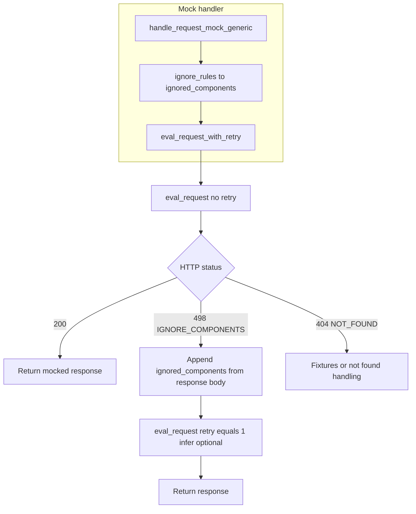
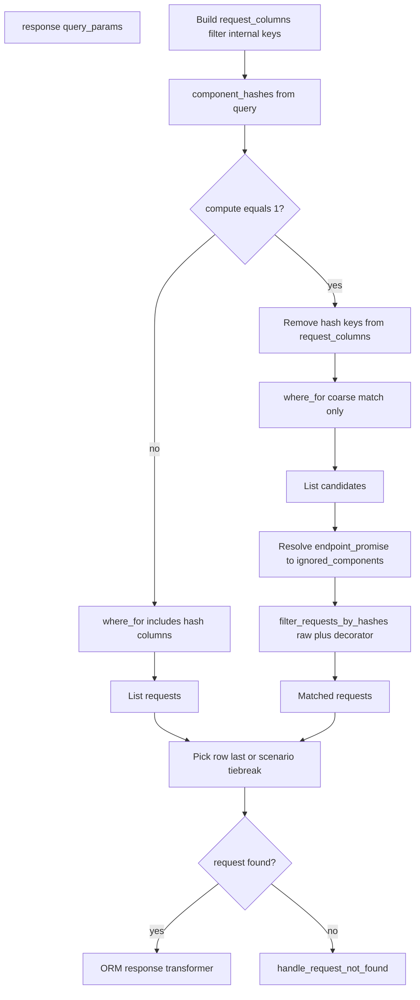
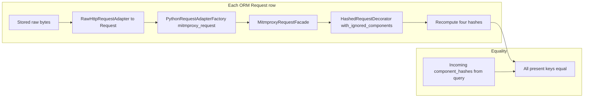

# Mock request matching

This document describes how the agent matches an **incoming proxied request** to a **recorded request** in the local database when serving mocks. Matching is primarily **hash-based** on normalized request parts. **Match rules** can drop hash dimensions for certain URLs. When **ignored components** (remote endpoint metadata) participate in a **retry**, the **`compute`** path can **re-hash stored raw traffic** so recorded rows still match even though persisted hash columns were computed at record time under different ignore rules.

## Remote project key and `compute`

When using a **local** request model with a **remote project key** (CLI `--remote-project-key` on `stoobly-agent run`, or `AGENT_REMOTE_PROJECT_KEY`), the mock path can resolve **which parameters to ignore** via the remote **endpoints** API (`search_endpoint` / `EndpointsResource.index`).

The query parameter **`compute=1`** (`stoobly_agent.config.constants.query_params.COMPUTE`) is passed into the local DB lookup when **all** of the following hold:

- The request model is local and a remote project key is configured.
- The call is a **retry** (after a **498** response with ignored components).
- **`ignored_components`** is non-empty.

That flag selects the **compute path** in `LocalDBRequestAdapter.response`: the ORM query omits hash columns to find **candidates**, then each candidate’s stored **`raw`** is re-hashed with `HashedRequestDecorator` and the same `ignored_components` before comparing to the incoming hashes.

## Hash dimensions

[`HashedRequestDecorator`](../stoobly_agent/app/proxy/mock/hashed_request_decorator.py) derives MD5 hashes from:

- **Headers** — serialized key/value pairs; configured header names can be ignored.
- **Query parameters** — multi-value aware; ignored query param names are excluded from the serialized material.
- **Body** — either **parsed body params** (`body_params_hash`) or **raw body** (`body_text_hash`), depending on body shape and whether body-param ignores apply; see [`__build_request_params`](../stoobly_agent/app/proxy/mock/eval_request_service.py).

**Ignored components** use typed entries (`HEADER`, `QUERY_PARAM`, `BODY_PARAM`, …) and strip the matching parts **before** hashing the live request. The same rules apply when recomputing hashes from each candidate’s stored request in **compute** mode.

## Mock handler and retry loop

## `eval_request` parameter pipeline

```mermaid
flowchart LR
  subgraph scope [Scoping]
    PK[project_key scenario_key]
  end
  subgraph identity [Identity and hashes]
    Core[host path port method]
    HH[HashedRequestDecorator with ignored_components]
    H1[headers_hash query_params_hash body hashes]
  end
  subgraph rules [Match rules]
    MR[URL regex plus method]
    Drop[Drop hash keys not in rule components]
  end
  subgraph remote [Local plus remote project]
    EP[endpoint_promise search_endpoint API]
    C1[compute equals 1 if retry and ignores and remote key]
  end
  subgraph persistLayer [Persistence call]
    RM[request_model.response query_params]
  end
  PK --> Core
  Core --> HH --> H1
  H1 --> MR --> Drop
  Drop --> EP
  EP --> C1 --> RM
```

## Local DB `response` lookup without `request_id`

## `filter_requests_by_hashes` per candidate

## Entry: mock handler → `eval_request`

[`handle_request_mock_generic`](../stoobly_agent/app/proxy/handle_mock_service.py) may add **ignored components** derived from **ignore rules**, then invokes [`eval_request`](../stoobly_agent/app/proxy/mock/eval_request_service.py).

**Retry loop** ([`eval_request_with_retry`](../stoobly_agent/app/proxy/handle_mock_service.py)):

1. First attempt: `eval_request(request, ignored_components)` (no `retry`).
2. If the response status is **498** (`IGNORE_COMPONENTS`), the client appends JSON from the response body to `ignored_components` and calls again with `retry=1` and optional `infer`.

## Building lookup parameters (`eval_request`)

- **Scoping** — `project_key` / `scenario_key` via `ParamBuilder.with_resource_scoping` (invalid keys → custom not found).
- **Core identity** — `host`, `path`, `port`, `method` from [`MitmproxyRequestFacade`](../stoobly_agent/app/proxy/mitmproxy/request_facade.py).
- **Hashes** — [`__build_request_params`](../stoobly_agent/app/proxy/mock/eval_request_service.py) uses [`HashedRequestDecorator`](../stoobly_agent/app/proxy/mock/hashed_request_decorator.py) for MD5 hashes; ignored component names exclude those parts before hashing.
- **Match rules** — [`__filter_by_match_rules`](../stoobly_agent/app/proxy/mock/eval_request_service.py): URL regex and method can **omit** `headers_hash`, `query_params_hash`, and/or body hashes from the lookup.
- **Optional** — `request_id`, `session_id`, `retry`, `infer` from headers or options.
- **Remote endpoint metadata** — When the request model is **local** and a **remote project key** is set, an **`endpoint_promise`** may be attached. When evaluated, it calls the remote endpoints API ([`search_endpoint`](../stoobly_agent/app/proxy/mock/search_endpoint.py)), e.g. with `ignored_components=1`, to obtain ignore metadata for that method/URL.
- **`compute=1`** — Set under the conditions in [Remote project key and `compute`](#remote-project-key-and-compute); triggers the local DB recomputation path.

## Local DB resolution (`LocalDBRequestAdapter.response`)

When there is no explicit `request_id`:

1. Build **`request_columns`** from query params (internal keys stripped via [`__filter_request_response_columns`](../stoobly_agent/app/models/factories/resource/local_db/request_adapter.py)).
2. Extract **`component_hashes`**: any of `headers_hash`, `query_params_hash`, `body_params_hash`, `body_text_hash` present on the query ([`component_hashes`](../stoobly_agent/app/models/factories/resource/local_db/helpers/filter_requests_by_hashes_service.py)).
3. **Default path** (`compute` not `'1'`) — ORM [`where_for(**request_columns)`](../stoobly_agent/app/models/factories/resource/local_db/request_adapter.py) includes hash columns; the row must match **persisted** hashes from capture time.
4. **Compute path** (`compute='1'`) — Hash keys are removed from `request_columns` so the query matches **method, host, path, port, scenario**, etc. [`filter_requests_by_hashes`](../stoobly_agent/app/models/factories/resource/local_db/helpers/filter_requests_by_hashes_service.py) parses each candidate’s **`raw`**, applies [`HashedRequestDecorator(...).with_ignored_components`](../stoobly_agent/app/models/factories/resource/local_db/helpers/filter_requests_by_hashes_service.py), recomputes hashes, and keeps rows that match all supplied `component_hashes`. **`ignored_components`** come from resolving `endpoint_promise` ([`__ignored_components`](../stoobly_agent/app/models/factories/resource/local_db/request_adapter.py)). After filtering, `endpoint_promise` is cleared on `query_params` to avoid leaking ignore metadata on later not-found handling.
5. **Choose row** — Without `scenario_id`, the last row in the result list (most recent order); with `scenario_id`, existing session/tie-break logic applies.

**Rationale for compute mode:** Snapshots persist hash columns from **record** time. A **retry** that ignores (for example) a query parameter changes the **incoming** hashes. Direct equality on stored hash columns would miss. Compute mode widens the query, then **re-hashes stored traffic** with the **same** ignore list as the live request.

## Not found

If no row matches: [`__handle_request_not_found`](../stoobly_agent/app/models/factories/resource/local_db/request_adapter.py) may return **ignored components** from the endpoint promise via [`IgnoreComponentsResponseBuilder`](../stoobly_agent/app/proxy/mock/ignored_components_response_builder.py) (**498**), which drives the retry loop; otherwise a **not found** response is returned (custom builder).

## Primary code references

| Concern | Location |
|--------|----------|
| Mock entry, retry | [`handle_mock_service.py`](../stoobly_agent/app/proxy/handle_mock_service.py) |
| Query / hashes / match rules / `compute` | [`eval_request_service.py`](../stoobly_agent/app/proxy/mock/eval_request_service.py) |
| Local DB lookup and compute path | [`request_adapter.py`](../stoobly_agent/app/models/factories/resource/local_db/request_adapter.py) |
| Candidate filtering by recomputed hashes | [`filter_requests_by_hashes_service.py`](../stoobly_agent/app/models/factories/resource/local_db/helpers/filter_requests_by_hashes_service.py) |
| Hashing and ignores | [`hashed_request_decorator.py`](../stoobly_agent/app/proxy/mock/hashed_request_decorator.py) |
