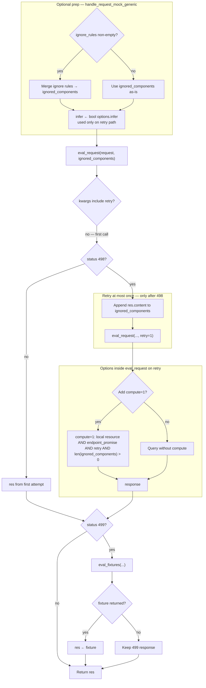
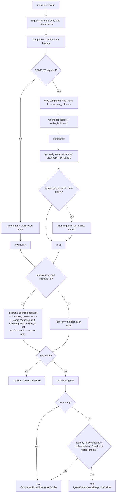
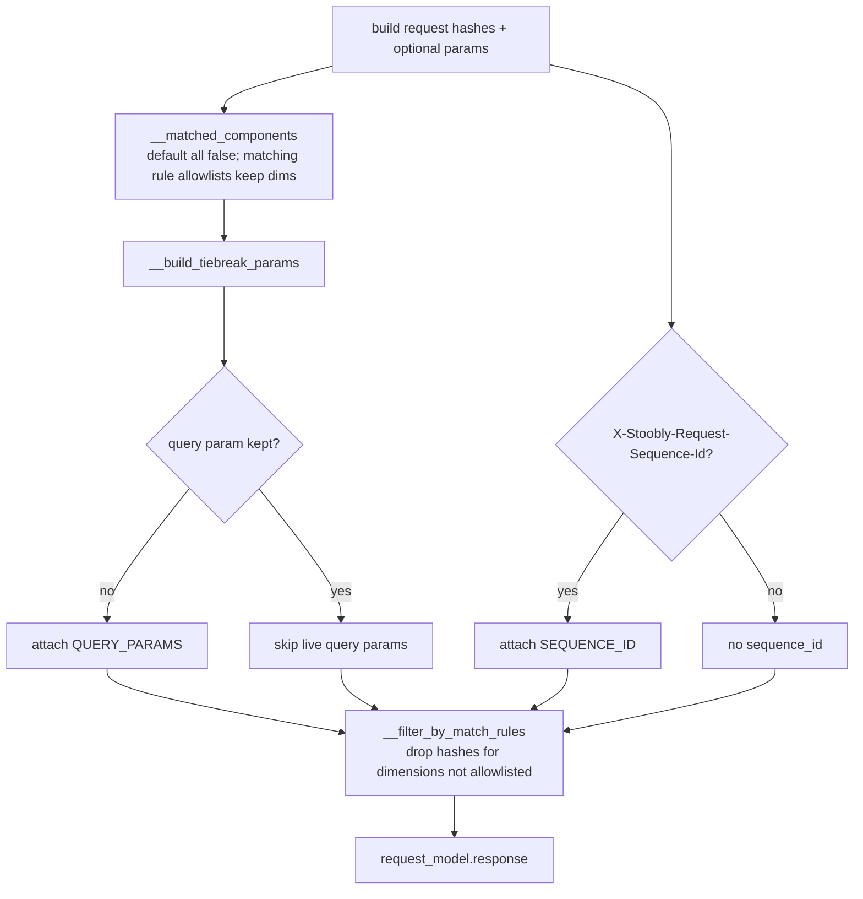

# Mock request matching

## Background

How an **incoming proxied request** is matched to a **recorded row** in the local DB for mocks: **endpoint identity** (host / path / port / method), optional **hash dimensions** enabled by **match-rule allowlists**, **scenario tiebreak** when multiple rows remain, and optional **`compute`** to re-hash stored `raw` when **ignored components** change between record time and the retry path. Custom status codes: **`IGNORE_COMPONENTS = 498`**, **`NOT_FOUND = 499`** ([`custom_response_codes`](../stoobly_agent/app/proxy/constants/custom_response_codes.py)) — not standard HTTP 404/498.

### Endpoint lookup and `compute`

When mocking against **local DB**, [`eval_request`](../stoobly_agent/app/proxy/mock/eval_request_service.py) may attach an `endpoint_promise` from either:

- remote project endpoint search via [`search_endpoint`](../stoobly_agent/app/proxy/mock/search_endpoint.py), or
- OpenAPI endpoint search via [`search_open_api_endpoint`](../stoobly_agent/app/proxy/mock/search_open_api_endpoint.py).

If `endpoint_promise` exists, and the request is on **retry** with non-empty ignored components, **`compute='1'`** is attached ([`COMPUTE`](../stoobly_agent/config/constants/query_params.py)). That widens the ORM query and runs [`filter_requests_by_hashes`](../stoobly_agent/app/models/factories/resource/local_db/helpers/filter_requests_by_hashes_service.py) so stored **`raw`** is re-hashed with the same ignores as the live request.

### Endpoint cache behavior (remote + OpenAPI)

[`endpoint_cache`](../stoobly_agent/app/proxy/mock/endpoint_cache.py) is a singleton used by both search paths. It:

- caches parsed OpenAPI specs by normalized absolute path,
- caches remote endpoint index calls by `(project_id, index_params)`,
- merges both layers into one endpoint-id map, where **latest merge wins** on ID collisions,
- returns OpenAPI-derived ignored components from optional/nondeterministic fields (query/header/body/response-header),
- prefetches remote endpoints from settings when remote mode is enabled.

### Hash dimensions

[`HashedRequestDecorator`](../stoobly_agent/app/proxy/mock/hashed_request_decorator.py): MD5 over **headers**, **query params** (multi-value), **body** as params or raw text per [`__build_request_params`](../stoobly_agent/app/proxy/mock/eval_request_service.py). Typed **ignored components** (`HEADER`, `QUERY_PARAM`, `BODY_PARAM`, …) exclude matching parts before hashing.

Hashes are always **computed**, but only dimensions **kept** by a match rule are passed to the ORM lookup (see below).

### Match rules (component allowlists)

Match rules are **allowlists**, not denylists. [`__matched_components`](../stoobly_agent/app/proxy/mock/eval_request_service.py) starts with every hash dimension **off** (`Header`, `Query Param`, `Body Param` → `False`). For each rule whose **method** and **URL pattern** match the live request, the rule’s `components` list becomes the keep set (**last matching rule wins**; rules do not merge).

| Situation | Hash columns sent to ORM | Live tiebreak params |
|-----------|--------------------------|----------------------|
| **No** matching rule (default) | None — identity is host / path / port / method only | Live query params (when present) |
| Rule lists e.g. `Query Param` | Only `query_params_hash` | None for query (already hashed); optional `SEQUENCE_ID` |
| Rule lists all three components | All component hashes | Optional `SEQUENCE_ID` only |

[`__filter_by_match_rules`](../stoobly_agent/app/proxy/mock/eval_request_service.py) deletes hashes for dimensions not kept. The same keep set drives [`__build_tiebreak_params`](../stoobly_agent/app/proxy/mock/eval_request_service.py):

- Query param dimension **not** kept → attach live `QUERY_PARAMS` for fuzzy overlap. Body is never scored in tiebreak—only hashed when allowlisted.
- Dimension **kept** → skip the corresponding live param (exact hash already distinguishes candidates).
- Optional `X-Stoobly-Request-Sequence-Id` → attach `SEQUENCE_ID` for sequence-based tiebreak (independent of match rules).

### Scenario tiebreak

When local DB lookup returns **multiple** rows for a scenario, [`tiebreak_scenario_request`](../stoobly_agent/app/models/factories/resource/local_db/helpers/tiebreak_scenario_request.py) picks one:

1. Score candidates by live query-param overlap (if `QUERY_PARAMS` present); unique best score wins.
2. Else if `SEQUENCE_ID` is set on the **incoming** request, pick the candidate whose stored `sequence_id` equals that value (exact match).
3. Else fall back to session order (next request after last served id; candidates are ordered by `id` ascending).

**Incoming `SEQUENCE_ID`:** set from `X-Stoobly-Request-Sequence-Id` during mock. If the header is absent or not a valid int, sequence-id tiebreak is skipped and the cascade continues to session order (after any query-param win).

**Recorded `sequence_id`:** set at record/create time from the same header (or a create body `sequence_id` param). Candidates with a null stored `sequence_id` are ignored during exact-match scoring. If the incoming `SEQUENCE_ID` is set but no candidate has that exact non-null value, sequence-id tiebreak fails and session order is used.

Without a scenario, multiple matches resolve to the **highest id** (most recent).

---

## Diagram: mock handler, ignored components, and `eval_request_with_retry`

[`eval_request_with_retry`](../stoobly_agent/app/proxy/handle_mock_service.py) merges **ignore rules** into `ignored_components` earlier in [`handle_request_mock_generic`](../stoobly_agent/app/proxy/handle_mock_service.py) (same list used for both attempts).

---

## Diagram: local DB `response` when no `request_id`

[`LocalDBRequestAdapter.response`](../stoobly_agent/app/models/factories/resource/local_db/request_adapter.py) reads **`retry`** from `query_params` (used only when **no row** matches). **`COMPUTE`** is stripped from ORM columns in [`__filter_request_response_columns`](../stoobly_agent/app/models/factories/resource/local_db/request_adapter.py).

---

## Diagram: match rules → hashes and live tiebreak params

Inside [`eval_request`](../stoobly_agent/app/proxy/mock/eval_request_service.py), before calling `request_model.response`. Keep flags default **off**; a matching rule’s `components` are an **allowlist** (last match wins).

---

## Primary code references

| Concern | Location |
|--------|----------|
| Mock entry, retry, fixtures | [`handle_mock_service.py`](../stoobly_agent/app/proxy/handle_mock_service.py) |
| Query / hashes / match rules / live tiebreak params / `compute` | [`eval_request_service.py`](../stoobly_agent/app/proxy/mock/eval_request_service.py) |
| Endpoint cache + OpenAPI ignored-component derivation | [`endpoint_cache.py`](../stoobly_agent/app/proxy/mock/endpoint_cache.py) |
| Remote endpoint search adapter | [`search_endpoint.py`](../stoobly_agent/app/proxy/mock/search_endpoint.py) |
| OpenAPI endpoint search adapter | [`search_open_api_endpoint.py`](../stoobly_agent/app/proxy/mock/search_open_api_endpoint.py) |
| Local DB lookup, strip columns, not found 498/499 | [`request_adapter.py`](../stoobly_agent/app/models/factories/resource/local_db/request_adapter.py) |
| Scenario multi-row tiebreak | [`tiebreak_scenario_request.py`](../stoobly_agent/app/models/factories/resource/local_db/helpers/tiebreak_scenario_request.py) |
| Candidate filtering | [`filter_requests_by_hashes_service.py`](../stoobly_agent/app/models/factories/resource/local_db/helpers/filter_requests_by_hashes_service.py) |
| Hashing | [`hashed_request_decorator.py`](../stoobly_agent/app/proxy/mock/hashed_request_decorator.py) |
| Unit: match-rule allowlist → `response` kwargs | [`eval_request_service_test.py`](../stoobly_agent/test/app/proxy/mock/eval_request_service_test.py) |
| Unit: 498 retry / 499 fixtures | [`handle_mock_service_test.py`](../stoobly_agent/test/app/proxy/handle_mock_service_test.py) |
| Unit: adapter tiebreak / compute / 499 | [`request_adapter_test.py`](../stoobly_agent/test/app/models/factories/resource/local_db/request_adapter_test.py) (`TestWhenResponse`) |
